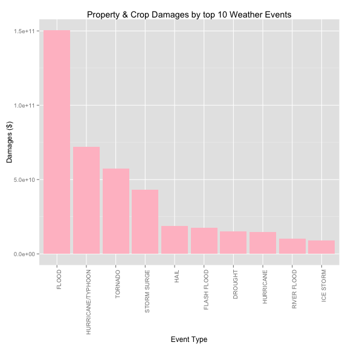

## Introduction

Storms and other severe weather events can cause both public health and economic problems for communities and municipalities. Many severe events can result in fatalities, injuries, and property damage, and preventing such outcomes to the extent possible is a key concern.  

This project involves exploring the U.S. National Oceanic and Atmospheric Administration's (NOAA) storm database. This database tracks characteristics of major storms and weather events in the United States, including when and where they occur, as well as estimates of any fatalities, injuries, and property damage.  

### Data  

The data for this assignment come in the form of a comma-separated-value file compressed via the bzip2 algorithm to reduce its size. You can download the file from the link below:  

https://d396qusza40orc.cloudfront.net/repdata%2Fdata%2FStormData.csv.bz2

There is also some documentation of the database available. Here you will find how some of the variables are constructed/defined.  

National Weather Service Storm Data Documentation: 
- https://d396qusza40orc.cloudfront.net/repdata%2Fpeer2_doc%2Fpd01016005curr.pdf  

National Climatic Data Center Storm Events FAQ: 
- https://d396qusza40orc.cloudfront.net/repdata%2Fpeer2_doc%2FNCDC%20Storm%20Events-FAQ%20Page.pdf  

The events in the database start in the year 1950 and end in November 2011. In the earlier years of the database there are generally fewer events recorded, most likely due to a lack of good records. More recent years should be considered more complete.  

### Assignment  

The basic goal of this assignment is to explore the NOAA Storm Database and answer some basic questions about severe weather events. You must use the database to answer the questions below and show the code for your entire analysis. Your analysis can consist of tables, figures, or other summaries. You may use any R package you want to support your analysis.  

## Loading Data and Packages  

```r
## Loads all required libraries (ggplot2)
if (!require("ggplot2")) {
  install.packages("ggplot2")
  library("ggplot2")
  message("Required ggplot2 package is now in place.")
} else {
  message("Required ggplot2 package is already in place.")
}
```

```
## Loading required package: ggplot2
## Required ggplot2 package is already in place.
```

```r
## Tests if dataset was downloaded and unziped
## If can't find the unziped dataset, it unzips the downloaded zip file
## If can't find the unziped dataset, nor the zip file itself, it downloads and unzips it

workingDir <- getwd()
datasetFile <- paste0(workingDir,"/stormData.csv")
datasetZipFile <- paste0(workingDir,"/stormData.csv.bz2")
if (file.exists(datasetFile)) {
  message("Dataset is already in place.")
  message("All set. Moving forward with the script.")
} else {
  message("Unziped dataset not detected.")
  if (!file.exists(datasetZipFile)){
    message("Ziped dataset wasn't found. Please wait while it is downloaded and unziped.")
    TempFile <- tempfile()
    download.file("https://d396qusza40orc.cloudfront.net/repdata%2Fdata%2FStormData.csv.bz2",TempFile, method="curl")
    bzfile(TempFile)
    unlink(TempFile)
    message("All set. Moving forward with the script.")
  } else {
    message("Ziped dataset was found. Unziping its content. Please wait.")
    bzfile(datasetZipFile)
    message("All set. Moving forward with the script.")
  }
}
```

```
## Dataset is already in place.
## All set. Moving forward with the script.
```
### Preparing Data for Analysis  

```r
## Reads the dataset into a table and subsets it 
datasetStorm <- read.csv("stormData.csv", sep=",", header=TRUE)
datasetTidyStorm <- datasetStorm[,c('EVTYPE','FATALITIES','INJURIES', 'PROPDMG', 'PROPDMGEXP', 'CROPDMG', 'CROPDMGEXP')]

# Unit conversion for Property and Crop Damage calculations 
datasetTidyStorm$PROPDMGNUM = 0
datasetTidyStorm$CROPDMGNUM = 0
datasetTidyStorm[datasetTidyStorm$PROPDMGEXP == "H", ]$PROPDMGNUM = datasetTidyStorm[datasetTidyStorm$PROPDMGEXP == "H", ]$PROPDMG * 10^2
datasetTidyStorm[datasetTidyStorm$PROPDMGEXP == "K", ]$PROPDMGNUM = datasetTidyStorm[datasetTidyStorm$PROPDMGEXP == "K", ]$PROPDMG * 10^3
datasetTidyStorm[datasetTidyStorm$PROPDMGEXP == "M", ]$PROPDMGNUM = datasetTidyStorm[datasetTidyStorm$PROPDMGEXP == "M", ]$PROPDMG * 10^6
datasetTidyStorm[datasetTidyStorm$PROPDMGEXP == "B", ]$PROPDMGNUM = datasetTidyStorm[datasetTidyStorm$PROPDMGEXP == "B", ]$PROPDMG * 10^9
datasetTidyStorm[datasetTidyStorm$CROPDMGEXP == "H", ]$CROPDMGNUM = datasetTidyStorm[datasetTidyStorm$CROPDMGEXP == "H", ]$CROPDMG * 10^2
datasetTidyStorm[datasetTidyStorm$CROPDMGEXP == "K", ]$CROPDMGNUM = datasetTidyStorm[datasetTidyStorm$CROPDMGEXP == "K", ]$CROPDMG * 10^3
datasetTidyStorm[datasetTidyStorm$CROPDMGEXP == "M", ]$CROPDMGNUM = datasetTidyStorm[datasetTidyStorm$CROPDMGEXP == "M", ]$CROPDMG * 10^6
datasetTidyStorm[datasetTidyStorm$CROPDMGEXP == "B", ]$CROPDMGNUM = datasetTidyStorm[datasetTidyStorm$CROPDMGEXP == "B", ]$CROPDMG * 10^9
```
### Questions  

Your data analysis must address the following questions:  

- Plot 1: Across the United States, which types of events (as indicated in the EVTYPE variable) are most harmful with respect to population health?  


```r
datasetStormFatalities <- aggregate(FATALITIES ~ EVTYPE, data=datasetTidyStorm, sum)
datasetStormFatalities <- datasetStormFatalities[order(-datasetStormFatalities$FATALITIES), ][1:10, ]
datasetStormFatalities$EVTYPE <- factor(datasetStormFatalities$EVTYPE, levels = datasetStormFatalities$EVTYPE)

ggplot(datasetStormFatalities, aes(x = EVTYPE, y = FATALITIES)) + 
  geom_bar(stat = "identity", fill = "blue", las = 3) + 
  theme(axis.text.x = element_text(angle = 90, hjust = 1)) + 
  xlab("Event Type") + ylab("Fatalities") + ggtitle("Number of fatalities by top 10 Weather Events")
```

 

- Plot 2: Across the United States, which types of events have the greatest economic consequences?  

```r
datasetInjuries <- aggregate(INJURIES ~ EVTYPE, data=datasetTidyStorm, sum)
datasetInjuries <- datasetInjuries[order(-datasetInjuries$INJURIES), ][1:10, ]
datasetInjuries$EVTYPE <- factor(datasetInjuries$EVTYPE, levels = datasetInjuries$EVTYPE)

ggplot(datasetInjuries, aes(x = EVTYPE, y = INJURIES)) + 
  geom_bar(stat = "identity", fill = "green", las = 3) + 
  theme(axis.text.x = element_text(angle = 90, hjust = 1)) + 
  xlab("Event Type") + ylab("Injuries") + ggtitle("Number of injuries by top 10 Weather Events")
```

 

- Plot 3: Consider writing your report as if it were to be read by a government or municipal manager who might be responsible for preparing for severe weather events and will need to prioritize resources for different types of events. However, there is no need to make any specific recommendations in your report.  

```r
datasetDamages <- aggregate(PROPDMGNUM + CROPDMGNUM ~ EVTYPE, data=datasetTidyStorm, sum)
names(datasetDamages) = c("EVTYPE", "TOTALDAMAGE")
datasetDamages <- datasetDamages[order(-datasetDamages$TOTALDAMAGE), ][1:10, ]
datasetDamages$EVTYPE <- factor(datasetDamages$EVTYPE, levels = datasetDamages$EVTYPE)

ggplot(datasetDamages, aes(x = EVTYPE, y = TOTALDAMAGE)) + 
  geom_bar(stat = "identity", fill = "pink", las = 3) + 
  theme(axis.text.x = element_text(angle = 90, hjust = 1)) + 
  xlab("Event Type") + ylab("Damages ($)") + ggtitle("Property & Crop Damages by top 10 Weather Events")
```

 

